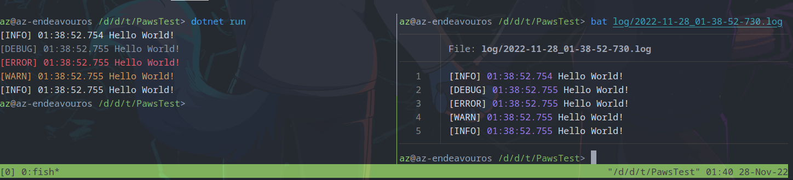

# Paws
Paws is a lightweight logging system written in modern C#

To use Paws, add the class library to your project and then `Paws.Setup()` and `Paws.Log()` should work.

Example of what each log level looks like:
